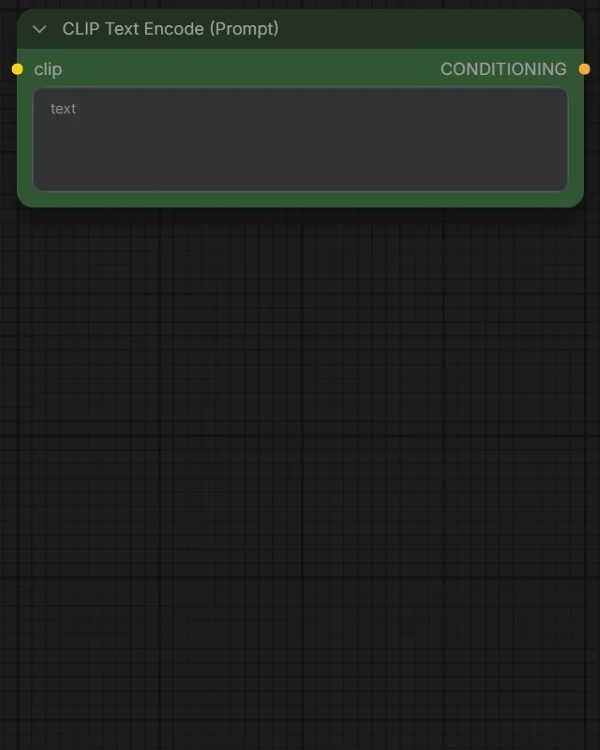
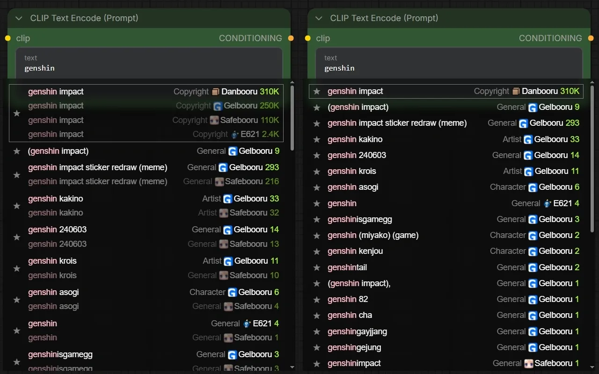
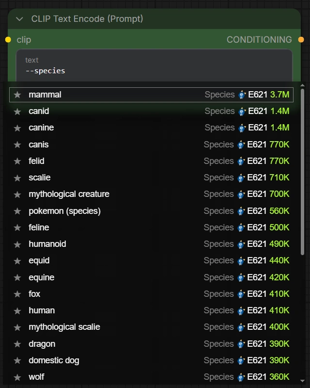
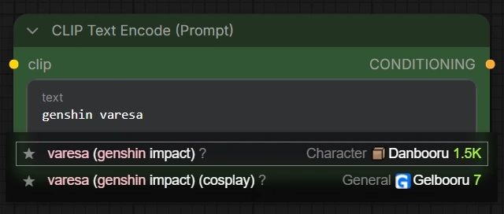
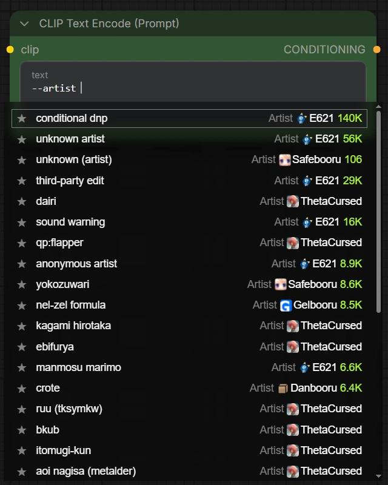
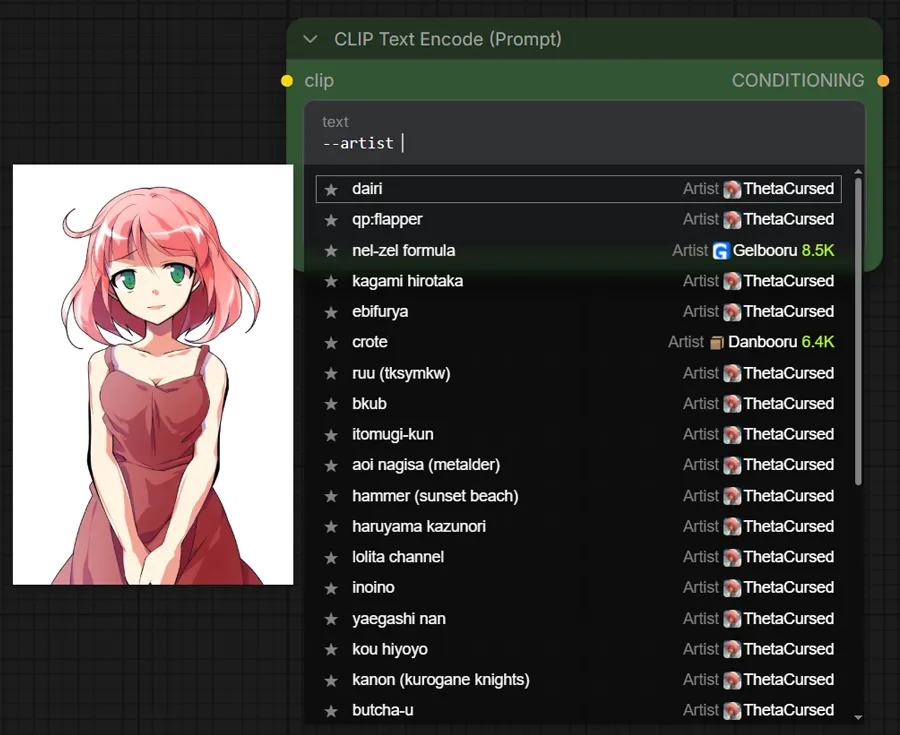
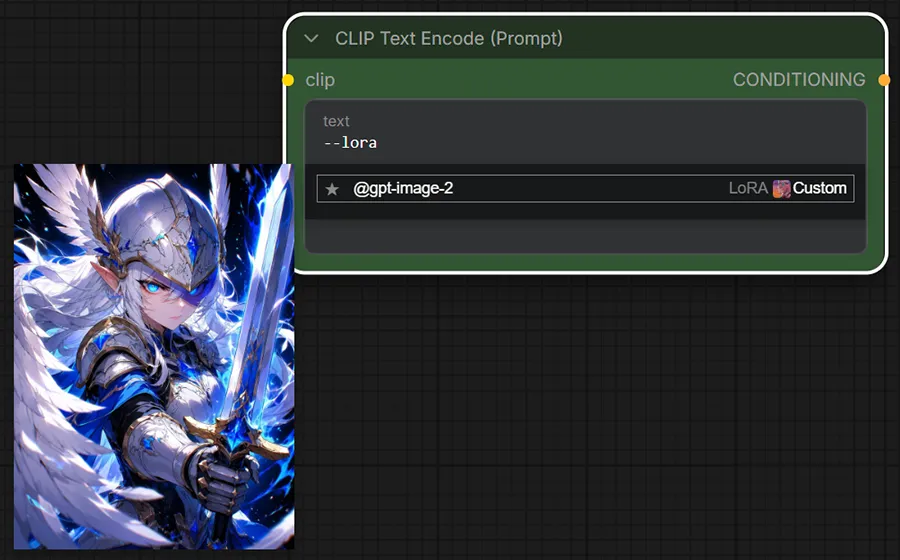
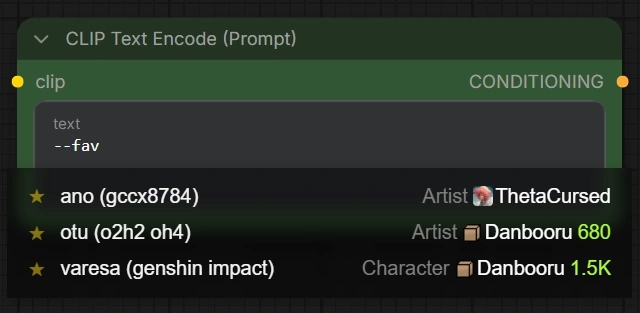
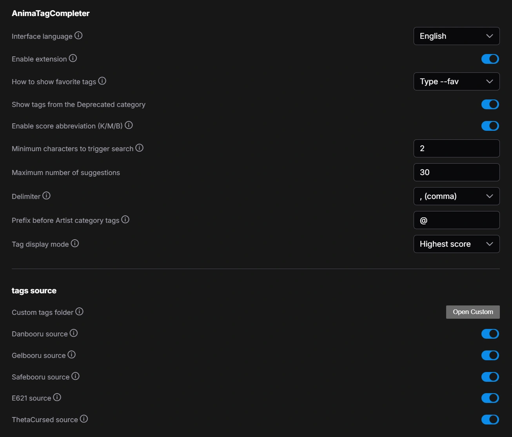
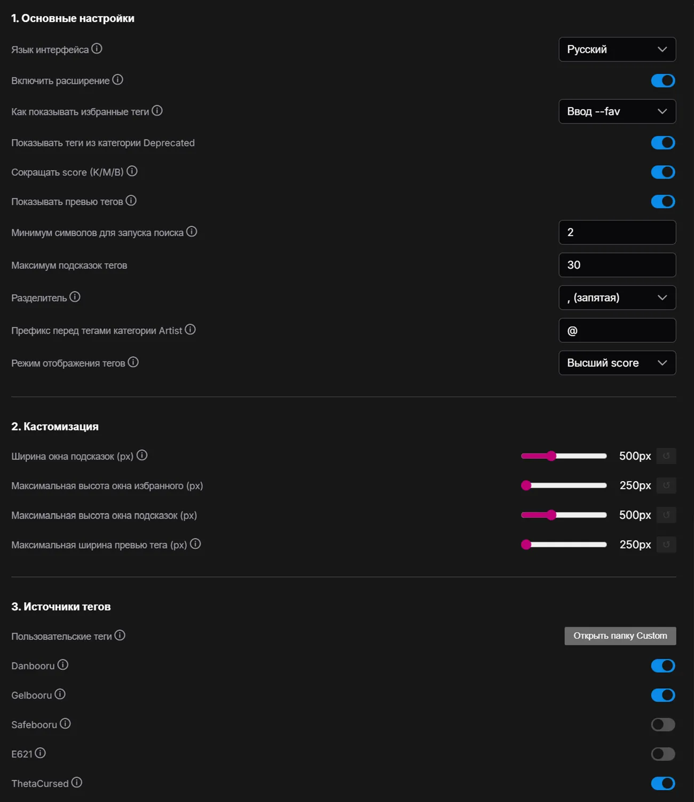

# AnimaTagCompleter

<details open>
<summary>English</summary>

###

This extension adds booru-tag suggestions to ComfyUI for text entered in the input field.<br>
The extension is designed primarily for the Anima model, but it can also be used for other models that were trained on Booru tags.



### Note

This extension was created as a replacement for [comfy-ex-tagcomplete](https://github.com/jupo-ai/comfy-ex-tagcomplete) for personal use with the Anima model, so bugs are possible.

## Installation

```bash
cd ComfyUI/custom_nodes
git clone https://github.com/Lariany-Yana/AnimaTagCompleter.git
```
OR
```bash
comfy node install animatagcompleter
```

## Features

- Tag suggestion and insertion from CSV files
- Simultaneous search across multiple booru sources
- Tag search by categories
- Adding tags to favorites
- Adding custom categories and tags
- Artist search using the ThetaCursed list (with preview)

#### Tags included

-  Custom (your own tags and categories)
-  Danbooru (Data up to September 24, 2026)
-  Gelbooru (Data up to September 9, 2025)
-  Safebooru (Data up to August 6, 2025)
-  E621 (Data up to August 8, 2025)
-  ThetaCursed (59,676 Danbooru Artist List)

Gelbooru tags are better suited for Anima 2b, Danbooru tags for Anima 2.9b and 3.8b.<br>
The E621 tags might be useful for Anima 3.8b Expanded, I think.<br>
The ThetaCursed's artist list is best suited for the Anima 2b model, as other models were trained on a larger number of artists than Anima 2b knows and this list does not cover every artist.

#### Categories
- General
- Artist
- Copyright
- Character
- Metadata
- Species (E621 only)
- Deprecated (E621 and Gelbooru)
###
- Fav (Your favorite tags)
- LoRA (Trigger words for your LoRAs)
- Template (Ready-made sets of tags)

## Highlights

- The extension works in App Mode.
- Two tag display modes: "All matches" and "Highest score".<br>
In the first case, all sources where the found tag is present are displayed.<br>
In the second case, only the source with the highest score is displayed.



###

- After you type a category name followed by a space, all tags from that category are shown, sorted by score, without typing the first characters of a tag.



###
- When a tag is inserted, a space is automatically added before and after it.<br>
If a delimiter is enabled, a space is also added after the delimiter.<br>
If a tag is inserted into brackets, spaces and the delimiter are added outside them.
- If a tag contains brackets, a backslash is automatically added before them.
- Found tags are sorted first by how closely they match the input, then by score.
- If the words in a tag are entered in the wrong order, the results include an "implied" tag with a higher score.



###
- To help you know in advance which artist tags Anima is understand, the ThetaCursed source was added with a single category, Artist. Tags from this source are prioritized and always shown first among other sources. If an artist tag is missing from the ThetaCursed source, Anima may not know it.



###
- For convenience, hovering over a tag from the ThetaCursed list displays a preview. This can be disabled in the settings.



###
- You can disable all tag sources (except Custom) or leave only the ones you need (for example, Danbooru and ThetaCursed).
- In the /tags/Custom folder you can create your own CSV files (file name = category) with your own tags, for example, LoRA triggers, or templates for quickly sketching out a prompt.<br>
The idea is that you manually enter only the trigger words you need, instead of using safetensors metadata, which may contain a huge list of trigger words rather than just one or two.
- You can add a preview for custom tags:<br>
You need to place the image in the "preview" folder and add a third column to the CSV file for the relevant tag—specifying the filename (as a path relative to the root of the "preview" folder)—while ensuring the second column is either empty or contains a score.<br>
Example: `@gpt-image-2,,"Custom/@gpt-image-2.webp"`



###
- You can add tags to your own favorites category.



## Settings



###

| Setting | Description |
| --- | --- |
| Interface language | `English`/`Русский` Switches the language for the extension's settings interface. Requires a page reload.<br>Default `English` |
| Enable extension | `On`/`Off` Enables/Disables the extension.<br>Default `On` |
| How to show favorite tags | `Type --fav`/`Click on input` Choice of when favorite tags will be displayed.<br>Default `Type --fav` |
| Show tags from the Deprecated category | `On`/`Off` Determines whether tags from the Deprecated category will be shown (does not disable the category).<br>Default `On` |
| Enable score abbreviation (K/M/B) | `On`/`Off` Determines whether score values will be abbreviated. Abbreviates values to the first two digits (does not round).<br>Default `On` |
| Show tag preview images | `On`/`Off` Enables/Disables the tag preview images.<br>Default `On` |
| Minimum characters to trigger search | `number` Determines how many characters need to be entered to start a tag search (does not affect category search).<br>Default `2` |
| Maximum number of suggestions | `number` Determines how many tags will be shown in the list at most.<br>Default `30` |
| Delimiter | `, (comma)`/`. (period)`/`None` Determines which delimiter will be inserted after a tag.<br>Default `, (comma)` |
| Prefix before Artist category tags | `text` Choice of the prefix that will be used for tags from the Artist category.<br>Default `@` |
| Tag display mode | `All matches`/`Highest score` Choice of how tags will be displayed in the list.<br>Default `Highest score` |

| Customization | Description |
| --- | --- |
| Popup width (px) | `number` Sets the Suggestions and Favorites popups width.<br>Default `500px` |
| Favorites popup max height (px) | `number` Sets the Favorites popup max height.<br>Default `250px` |
| Suggestions popup max height (px) | `number` Sets the Suggestions popup max height.<br>Default `500px` |
| Preview image max width (px) | `number` Sets the Preview image max width. The maximum height is specified by the Suggestions popup max height.<br>Default `250px` |

| Source | Description |
| --- | --- |
| Custom tags | `Open folder` Opens the "AnimaTagCompleter/tags/Custom" folder |
| Danbooru | `On`/`Off` Determines whether this source will be used in the search<br>Default `On` |
| Gelbooru | `On`/`Off` Determines whether this source will be used in the search<br>Default `On` |
| Safebooru | `On`/`Off` Determines whether this source will be used in the searc<br>Default `Off` |
| E621 | `On`/`Off` Determines whether this source will be used in the search<br>Default `Off` |
| ThetaCursed | `On`/`Off` Determines whether this source will be used in the search<br>Default `On` |
</details>

<details>
<summary>Русский</summary>

###

Это расширение добавляет в ComfyUI функцию подсказок booru-тегов для вводимого в поле ввода текста.
Расширение спроектировано в первую очередь под модель Anima, но его также можно использовать и для других моделей, которые обучались на Booru тегах.


### Примечание

Это расширение было создано как замена [comfy-ex-tagcomplete](https://github.com/jupo-ai/comfy-ex-tagcomplete) для личного пользования с моделью Anima. Возможны баги и ошибки.

## Установка

```bash
cd ComfyUI/custom_nodes
git clone https://github.com/Lariany-Yana/AnimaTagCompleter.git
```
ЛИБО
```bash
comfy node install animatagcompleter
```

## Функции

- Подсказка и подстановка тегов из CSV-файлов
- Одновременный поиск по нескольким booru-источникам
- Поиск тегов по категориям
- Добавление тегов в избранное
- Добавление кастомных категорий и тегов
- Поиск художников из списка ThetaCursed (с превью)

#### Теги в комплекте

-  Custom (Свои кастомные теги и категории)
-  Danbooru (Данные до September 24, 2026)
-  Gelbooru (Данные до September 9, 2025)
-  Safebooru (Данные до August 6, 2025)
-  E621 (Данные до August 8, 2025)
-  ThetaCursed (59,676 Danbooru Artist List)

Теги Gelbooru лучше подойдут для Anima 2b, теги Danbooru - для Anima 2.9b и 3.8b.<br>
Теги E621 могут быть полезны для Anima 3.8b Expanded, по идее.<br>
Список художников от ThetaCursed лучше всего подходит для Anima 2b, ибо другие модели обучались на большем количестве художников чем знает Anima 2b, и этот список не охватывает всех художников.

#### Категории
- General
- Artist
- Copyright
- Character
- Metadata
- Species (Только у E621)
- Deprecated (E621 и Gelbooru)
###
- Fav (Ваши избранные теги)
- LoRA (Слова-триггеры для ваших LoRA)
- Template (Готовые наборы из тегов)

## Особенности

- Расширение работает в App Mode.
- 2 режима отображения тегов: "Все совпадения" и "Высший score".<br>
В первом случае отображаются все источники, где имеется найденный тег.<br>
Во втором случае отображается только источник с высшим score.


###
- При вводе категории все теги из неё отображаются после ввода пробела без необходимости ввода первых символов и сортируются по score.


###
- При вставке тега автоматически добавляется пробел перед ним и после него.<br>
Если включен разделитель, пробел добавляется после него.<br>
Если тег вставляется в скобки, пробелы и разделитель добавляются снаружи их.
- Если в теге имеются скобки, перед ними автоматически добавляется обратный слеш.
- Найденные теги в первую очередь показываются по совпадению с введённым текстом, и во вторую очередь по score.
- Если слова в теге написаны не в том порядке, в результатах предлагается "подразумеваемый" тег с бóльшим score.


###
- Для того чтобы заранее знать какой тег художника скорее всего поймёт Anima, был добавлен источник ThetaCursed с единственной категорией Artist, тег из этого источника является приоритетным и всегда будет отображаться первым среди других источников. Если у тега художника остутствует источник ThetaCursed, то есть вероятность, что Anima не знает этот тег.


###
- Для удобства при наведении на тег из списка ThetaCursed показывается превью. Это можно отключить в настройках.


###
- Можно отключить все источники тегов (кроме Custom) или оставить только нужные (например, Danbooru и ThetaCursed).
- В папке /tags/Custom можно создавать свои csv-файлы (название файла = категория) со своими тегами, например, триггеры для LoRA, или шаблонами для быстрой наброски промта.<br>
Подразумевается, что пользователь сам впишет нужные для него триггер-слова вместо использования мета-данных safetensors, где может быть полотно триггер-слов вместо одного или двух.
- Для кастомных тегов можно добавить превью:<br>
В папку "preview" нужно поместить изображение, и в CSV-файле для нужного тега добавить третью колонку (вторая колонка должна быть пустой либо иметь score) с указанием названия файла (Путь относительно корня папки preview).<br>
Пример: `@gpt-image-2,,"Custom/@gpt-image-2.webp"`


###
- Можно добавить теги в свою категорию Избранное.


## Настройки



###

| Настройка | Описание |
| --- | --- |
| Язык интерфейса | `English`/`Русский` Переключает язык для интерфейса настроек расширения. Требуется перезагрузка страницы.<br>По-умолчанию `English`. |
| Включить расширение | `Вкл`/`Выкл` Включает/Отключает расширение.<br>По-умолчанию `Вкл` |
| Как показывать избранные теги | `Ввод --fav`/`Клик на input` Выбор того когда будут отображаться избранные теги.<br>По-умолчанию `Ввод --fav` |
| Показывать теги из категории Deprecated | `Вкл`/`Выкл` Определяет будут ли показываться теги из категории Deprecated (не отключает категорию).<br>По-умолчанию `Вкл` |
| Сокращать score (K/M/B) | `Вкл`/`Выкл` Определяет будут ли сокращаться значения score. Сокращает значения до первых двух цифр (не округляет).<br>По-умолчанию `Вкл` |
| Показывать превью тегов | `Вкл`/`Выкл` Включает/выключает показ картинок-превью при наведении на тег.<br>По-умолчанию `Вкл` |
| Минимум символов для запуска поиска | `number` определяет сколько символов нужно ввести чтобы начался поиск по тегам (не влияет на поиск по категориям).<br>По-умолчанию `2` |
| Максимум подсказок тегов | `number` Определяет сколько максимум тегов будет показываться в списке.<br>По-умолчанию `30` |
| Разделитель | `, (запятая)`/`. (точка)`/`Нет` Определяет какой разделитель будет вставлятсья после тега.<br>По-умолчанию `, (запятая)` |
| Префикс перед тегами категории Artist | `text` Выбор префикса, который будет использоваться для тегов из категории Artist.<br>По-умолчанию `@` |
| Режим отображения тегов | `Все совпадения`/`Высший score` Выбор того как будут отображаться теги в списке.<br>По-умолчанию `Высший score` |

| Кастомизация | Описание |
| --- | --- |
| Ширина окна подсказок (px) | `number` Задаёт Ширина окна подсказок и избранного.<br>По-умолчанию `500px` |
| Максимальная высота окна избранного (px) | `number` Задаёт Максимальную высоту окна избранного.<br>По-умолчанию `250px` |
| Максимальная высота окна подсказок (px) | `number` Задаёт Максимальную высоту окна подсказок.<br>По-умолчанию `500px` |
| Максимальная ширина превью тега (px) | `number` Задаёт Максимальную ширину превью тега. Максимальная высота задаётся параметром Максимальная высота окна подсказок.<br>По-умолчанию `250px` |

| Источник | Описание |
| --- | --- |
| Папка Custom | `Открыть папку` Открывает папку "AnimaTagCompleter/tags/Custom" |
| Danbooru | `Вкл`/`Выкл` Определяет будет ли использоваться этот источник при поиске.<br>По-умолчанию `Вкл` |
| Gelbooru | `Вкл`/`Выкл` Определяет будет ли использоваться этот источник при поиске.<br>По-умолчанию `Вкл` |
| Safebooru | `Вкл`/`Выкл` Определяет будет ли использоваться этот источник при поиске.<br>По-умолчанию `Выкл` |
| E621 | `Вкл`/`Выкл` Определяет будет ли использоваться этот источник при поиске.<br>По-умолчанию `Выкл` |
| ThetaCursed | `Вкл`/`Выкл` Определяет будет ли использоваться этот источник при поиске.<br>По-умолчанию `Вкл` |
</details>